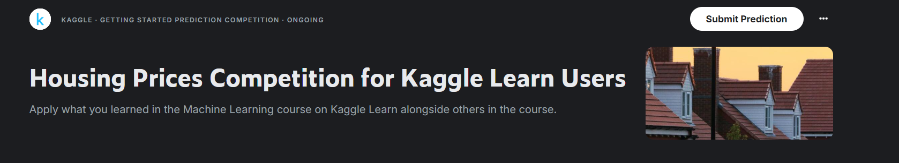
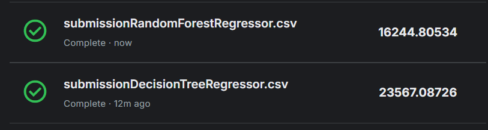

# 🏠 Housing Prices Prediction — Decision Tree vs. Random Forest

A machine learning project that predicts house sale prices using the [Kaggle House Prices dataset](https://www.kaggle.com/c/house-prices-advanced-regression-techniques). Two regression models are implemented and compared: **Decision Tree Regressor** and **Random Forest Regressor**.



---

## 📁 Project Structure

```
housing_prices/
│
├── data/
│   ├── train.csv                          # Training dataset
│   └── test.csv                           # Test dataset
│
├── DecisionTreeRegressor.py               # Decision Tree model
├── RandomForestRegressor.py               # Random Forest model
│
├── submissionDecisionTreeRegressor.csv    # Predictions from Decision Tree
├── submissionRandomForestRegressor.csv    # Predictions from Random Forest
│
└── README.md
```

---

## 📦 Dependencies

```bash
pip install pandas scikit-learn
```

---

## 🔢 Features Used

Both models use the same set of **27 input features** selected from the dataset:

| Category         | Features                                                                 |
|------------------|--------------------------------------------------------------------------|
| **Lot / Land**   | `MSSubClass`, `LotFrontage`, `LotArea`, `LotShape`                       |
| **Location**     | `Neighborhood`                                                           |
| **Style**        | `HouseStyle`, `Foundation`                                               |
| **Quality**      | `OverallQual`, `OverallCond`, `KitchenQual`, `BsmtQual`, `GarageFinish` |
| **Year**         | `YearBuilt`, `YearRemodAdd`                                              |
| **Basement**     | `BsmtUnfSF`, `TotalBsmtSF`, `BsmtFullBath`                              |
| **Living Area**  | `GrLivArea`, `1stFlrSF`, `2ndFlrSF`, `MasVnrArea`                      |
| **Rooms**        | `FullBath`, `HalfBath`, `TotRmsAbvGrd`, `Fireplaces`                    |
| **Garage**       | `GarageCars`, `GarageArea`                                               |
| **Sale Info**    | `MoSold`                                                                 |

> Categorical features (e.g. `Neighborhood`, `HouseStyle`) are encoded using **one-hot encoding** via `pd.get_dummies()`. Training and test sets are then **aligned** to ensure identical column structure, filling missing columns with `0`.

---

## 🌿 Model 1 — Decision Tree Regressor

**File:** `DecisionTreeRegressor.py`

### How it works

A Decision Tree splits the data recursively based on feature thresholds to minimize prediction error. Each leaf node represents a predicted house price.

### Key implementation details

```python
# Hyperparameter tuning: find the best max_leaf_nodes
candidate_max_leaf_nodes = [30, 31, 32, ..., 50]
scores = {
    leaf_size: get_mae_for_decision_tree(leaf_size, train_X, val_X, train_y, val_y)
    for leaf_size in candidate_max_leaf_nodes
}
best_tree_size = min(scores, key=scores.get)
```

- The model is tuned by iterating over a range of `max_leaf_nodes` values (30 to 50).
- For each candidate, the **Mean Absolute Error (MAE)** on the validation set is computed.
- The best `max_leaf_nodes` found was **34**, giving an MAE of approximately **23,075 USD**.
- The final model is retrained on the **full training set** (not just the train split) using the best parameter before generating predictions.

```python
final_model = DecisionTreeRegressor(max_leaf_nodes=34, random_state=0)
final_model.fit(X, y)
preds_test = final_model.predict(testing_X)
```

### Helper function

```python
def get_mae_for_decision_tree(max_leaf_nodes, train_X, val_X, train_y, val_y):
    model = DecisionTreeRegressor(max_leaf_nodes=max_leaf_nodes, random_state=0)
    model.fit(train_X, train_y)
    preds_val = model.predict(val_X)
    mae = mean_absolute_error(val_y, preds_val)
    return mae
```

### Result

| Metric | Value |
|--------|-------|
| Best `max_leaf_nodes` | 34 |
| Validation MAE | ~23,075 USD |

---

## 🌲🌲 Model 2 — Random Forest Regressor

**File:** `RandomForestRegressor.py`

### How it works

A Random Forest is an **ensemble** of many Decision Trees. Each tree is trained on a random subset of the training data (bootstrapping) and uses a random subset of features at each split. The final prediction is the **average** of all individual tree predictions.

### Key implementation details

```python
model = RandomForestRegressor(n_estimators=100, random_state=0)
model.fit(train_X, train_y)
preds_val = model.predict(val_X)
preds_test = model.predict(testing_X)
print(mean_absolute_error(val_y, preds_val))
```

- **`n_estimators=100`**: The forest is built using **100 decision trees**.
- No manual hyperparameter search is needed — the ensemble nature naturally reduces overfitting.
- The model is simpler to configure yet significantly more accurate.

### Result

| Metric | Value |
|--------|-------|
| `n_estimators` | 100 |
| Validation MAE | ~17,674 USD |

---

## ⚔️ Why Random Forest is Better Than Decision Tree

### 📊 Results Comparison

| Model | Validation MAE | Kaggle Score |
|-------|---------------|-------------|
| Decision Tree (best tuned) | ~23,075 USD | 23,567.08 |
| Random Forest (100 trees) | ~17,674 USD | 16,244.80 |

> **Random Forest achieves ~23.5% lower error** than the best tuned Decision Tree.

**Kaggle submission scores (lower is better):**



---

### 🧠 The Core Problems with a Single Decision Tree

#### 1. Overfitting (High Variance)
A single Decision Tree, if allowed to grow deep, **memorizes the training data** rather than learning general patterns. It captures noise and outliers as if they were real signals.

- With `max_leaf_nodes` unconstrained → the tree perfectly fits training data but performs poorly on new data.
- Even with tuning (`max_leaf_nodes=34`), the tree must sacrifice depth (and therefore accuracy) to avoid overfitting.

#### 2. Instability
Decision Trees are **highly sensitive** to small changes in the training data. A slightly different train/test split can produce a completely different tree structure. This makes a single tree an unreliable model.

#### 3. Bias-Variance Tradeoff is Hard to Balance
- A **shallow tree** (small `max_leaf_nodes`) → high bias (underfits, too simple)
- A **deep tree** (large `max_leaf_nodes`) → high variance (overfits, too complex)
- Finding the sweet spot requires careful tuning and it's never perfect.

---

### ✅ How Random Forest Solves These Problems

| Problem | Random Forest Solution |
|---------|------------------------|
| **Overfitting** | Each tree sees only a random subset of data (**bagging**). Averaging 100 trees cancels out individual overfitting. |
| **Instability** | Different trees make different errors. When averaged, random errors cancel each other out (variance reduction). |
| **Bias-Variance** | The ensemble naturally sits at a better tradeoff — lower variance without significantly increasing bias. |
| **Feature sensitivity** | Each split uses a **random subset of features**, preventing any single dominant feature from controlling all trees. |

---

### 📐 Mathematical Intuition

For a Random Forest with `n` trees, the ensemble prediction is:

```
ŷ = (1/n) × Σ ŷᵢ    for i = 1 to n
```

Since each tree's error `εᵢ` is independent (due to bagging and feature randomness):

```
Variance(ensemble) ≈ Variance(single tree) / n
```

With 100 trees, the variance (instability) of the prediction is reduced by a factor of ~100 compared to a single tree — which is why the MAE drops from ~23,075 to ~17,674.

---

### 🔑 Key Takeaway

> A single Decision Tree is like asking **one expert** for their opinion.  
> A Random Forest is like asking **100 different experts**, each with different perspectives, and taking the average — a much more reliable answer.

---

## 🚀 How to Run

### Decision Tree
```bash
python DecisionTreeRegressor.py
```
Outputs: `submissionDecisionTreeRegressor.csv`

### Random Forest
```bash
python RandomForestRegressor.py
```
Outputs: `submissionRandomForestRegressor.csv`

---

## 📈 Conclusion

Both models use the same features and preprocessing pipeline, making the comparison fair. The Random Forest consistently outperforms the Decision Tree because it leverages the power of **ensemble learning** — combining many weak learners into one strong predictor. For real-world regression tasks like housing price prediction, Random Forest is the preferred choice due to its better generalization, stability, and accuracy with minimal hyperparameter effort.
